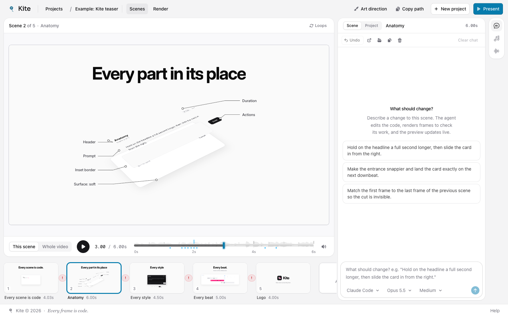

# Storyboard

⚠️ This is a personal software. No contribution accepted. Fork it and make changes for yourself if you want to

A local, prompt-driven motion-design editor. Every scene is a small piece of code; you change it by chatting with Claude next to a live preview, down to the millisecond. Finished videos export to MP4.

Inspired by [Caleb Porzio's tweet](https://x.com/calebporzio/status/2104945478055989489) about the editor he vibe-coded for his video.



- **Chat per scene, or about the whole video**, next to a live preview.
- **Music that drives the edit**: beats, bars and phrases are detected, and cuts snap to them.
- **Sound effects** placed on the same timing as the animation.
- **Optional**: Claude composes the soundtrack and generates realistic sound effects, on your own machine.

## Get started

You need macOS or Linux and [Node.js](https://nodejs.org) 22.12 or newer.

```bash
git clone https://github.com/saeedvaziry/caleb-video-editor.git
cd caleb-video-editor
./storyboard setup
./storyboard start
```

Setup walks you through the rest (ffmpeg, your Claude Code login, and whether you want music and sound-effect generation) and installs everything inside this folder. Run it again any time to change your choices. It installs packages with `npm ci --ignore-scripts`, so no package's install script ever runs: don't use `npm install` here.

## Commands

| | |
| --- | --- |
| `./storyboard setup` | Install, or change what's installed |
| `./storyboard start` | Start Storyboard in the background |
| `./storyboard stop` | Stop it |
| `./storyboard status` | See what's running |
| `./storyboard logs` | Show the log |
| `./storyboard doctor` | Check that everything is in place |

## More

- [Using Storyboard](docs/using-storyboard.md): the editor, sound effects, and the tools from your terminal
- [Music and sound effects](docs/music-and-sound.md): the optional engines
- [Configuration](docs/configuration.md) · [Troubleshooting](docs/troubleshooting.md)
- [How it works](docs/how-it-works.md) · [Developing Storyboard](docs/development.md)

## License

[MIT](LICENSE) © 2026 Saeed Vaziry. The optional music engine, ACE-Step 1.5, has its own MIT license; the optional sound model, Stable Audio Open 1.0, is downloaded from Hugging Face under the Stability AI Community License.
